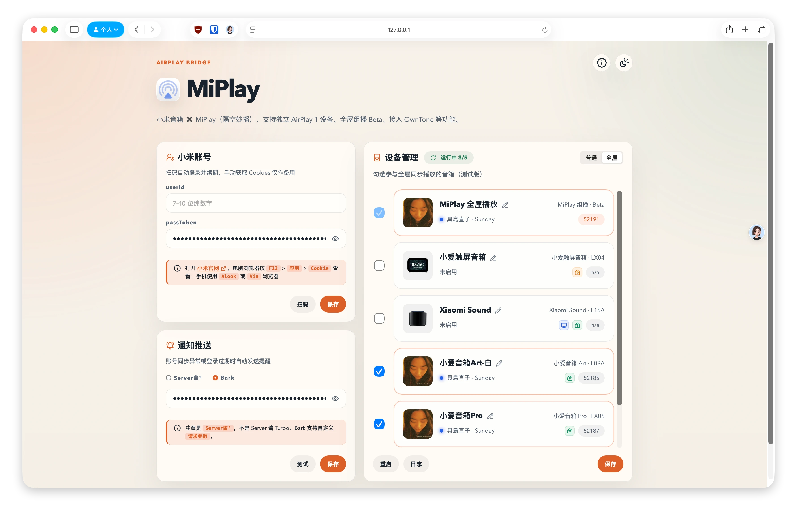

# MiXPlay 

MiXPlay（隔空妙播）是一个面向局域网的`开放式音频中枢`，融合 `AirPlay` 隔空播放、`MiPlay`小米妙播、`DLNA`、Plex/Caldera、OwnTone、API 等多种音频协议，搭载独家定制的全屋播放引擎，打破生态壁垒：除了**米果互通**，普通安卓与传统音箱也能解锁新玩法！





---

## ✨ 功能特色

- 🚀 **桥接 AirPlay**：局域网直连播放，低延迟无损直通
- 🚀 **模拟 MiPlay**：局域网直连播放，低延迟无损直通
- 🔥 **多房间同步播放**：定制版`MiXPlay 全屋播放`
- 🌐 **Web 虚拟音箱**：任意网页变虚拟音箱，展示歌曲信息
- 🔌 **通用音频 API**：标准的流媒体接口，轻松对接音乐库
- 🔥 **接入 OwnTone**：兼容跨协议的`多房间播放`
  - OwnTone 支持 AirPlay 1&2、Chromecast、DLNA 等
- 📦 **多平台通用**：支持 Windows、macOS、Linux、Android Termux 及 Docker 部署

MiXPlay 与苹果、小米、Plex 公司无关，作为局域网音频中枢必须在 NAS、PC、Mac 上运行`服务端`，覆盖多种音频协议和音箱设备，可玩性强但不适合所有人。

### 📊 音频方案对比

| 对比维度 | MiXPlay | AirPlay 1| AirPlay 2 | DLNA | 小米妙播 |
| :--- | :--- | :--- | :--- | :--- | :--- |
| **系统级音频投射** | ☑️ 支持 | ✅ 苹果 | ✅ 苹果 | ❌ 部分 App |  ✅ 小米 |
| **多房间同步播放** | ✅ 支持 | ☑️ 仅限 iTunes | ✅ 支持 | ❌ 不支持 | ✅ 支持 |
| **音频通信链路** | ☑️ 同步串流 | ☑️ 同步串流 | ✅ 独立协同 | ☑️ 分离遥控 | ✅ 独立协同 |
| **小米音箱** | ✅ 全系音箱* | ☑️ Sound 系列  | ☑️ Sound 系列 | ☑️ 部分音箱 | ☑️ 部分音箱 |
| **Plex/Caldera** | ✅ 原生支持 | ☑️ 安装 App  | ☑️ 安装 App | ❌ 不支持 | ☑️ 安装 App  |
| **OwnTone** | ✅ 支持 | ✅ 支持  | ✅ 支持| ✅ 支持 | ❌ 不支持 |
| **通用安卓*** | ✅ 支持 | ❌ 不支持  | ❌ 不支持 | ✅ 支持 | ❌ 不支持  |
| **硬件加密门槛** |  ✅ 无门槛 | ☑️ 苹果授权 | ☑️ 苹果授权 | ✅ 无门槛 | 🔒 小米独占 |

> 🔊 **MiXPlay 支持音箱列表** ➡️ [点我跳转查看](./speaker.md)

### 🤖 安卓特殊玩法
- 接收端，使用[FusionPlay-Android](https://github.com/rosienosiesie/FusionPlay-Android)，支持 AirPlay2、小米妙播、DLNA 接收功能
- 发射端，使用[centuryplay](https://github.com/g8row/centuryplay)，安卓 10+ 支持串流系统音频到 AirPlay 音箱


### 🎵 音频格式支持

* **原生直连格式**：`.mp3`、`.m4a`、`.flac`、`.wav`、`.m3u8`
  - 小米音箱硬件原生解码，音频数据由中枢直接转发，0 额外 CPU 转码开销，无损低延迟。
* **中枢转码扩展**：
  - 内置静态编译 **FFmpeg** 引擎，支持将非标准流实时转码推流至各个音箱端。

⚠️ 本项目主要是完善苹果用户的小米音箱 ✖️ AirPlay 体验，暂不考虑 DLNA 功能。
- DLNA 是一个古早的音频协议，虽然新老设备都能用，但体验不太好、稳定性欠佳
- 小米音箱自带 DLNA 功能不完整，第三方 DLNA 需额外适配，体验依然不完美
- 如果需要第三方 DLNA 功能，推荐使用 MiAir、miair-next 等项目

---
## ❤️ 支持项目

- 打赏鼓励：支持我开发更多有趣应用
- 互动群聊：加入 💬 [QQ 群](https://qm.qq.com/q/ZzOD5Qbhce) 可在线催更
- 更多内容：访问 ➡️ [谢週五の藏经阁](https://5nav.eu.org)

<div align="center">
  <table>
    <tr>
      <td align="center">
        <br/>
        <sub>微信</sub>
      </td>
      <td align="center">
        <br/>
        <sub>支付宝</sub>
      </td>
    </tr>
  </table>
</div>

---
## 🚀 安装方式

MiXPlay 目前支持以下主流平台和架构：
| 平台/架构 |  x86_64 | arm64 |
| :---: | :---: | :---: |
| Linux/NAS | ✅ | ✅ |
| macOS | ❌ | ✅ |
| Windows | ✅ | ❌ |

### 1、NAS（飞牛&Docker）
飞牛商店【🔍MiXPlay - 隔空妙播】，其他 NAS 可使用 Docker 版

```bash
services:
  mixplay:
    image: ghcr.io/juneix/mixplay
    # image: docker.1ms.run/juneix/mixplay  # 毫秒镜像加速
    container_name: mixplay
    network_mode: host
    restart: unless-stopped
    environment:
      WEB_PORT: 8820
    devices:
      - /dev/snd:/dev/snd
    volumes:
      - ./conf:/app/conf
      - /etc/machine-id:/host/etc/machine-id:ro
```


### 2、桌面端

a. 安装 uv 环境   
🍎 macOS / 🐧Linux
```bash
curl -LsSf https://astral.sh/uv/install.sh | sh
```
🪟 Windows
```bash
powershell -ExecutionPolicy ByPass -c "irm https://astral.sh/uv/install.ps1 | iex"
```
b. 安装 mixplay
```bash
uv tool install --python 3.12 mixplay-hub
```

打开终端输入 `mixplay-desktop`，自动后台运行，系统托盘可快速打开控制台、查看日志或退出。


## 🎈 版本区别

| 功能 | 普通用户 | 头号玩家 |
| :---: | :---: | :---: |
| Audio Hub 音频中枢 | ☑️ | ✅ |
| 小米音箱➡️AirPlay1 | ☑️ | ✅ |
| 服务端音箱➡️AirPlay1、妙播、DLNA | ☑️ | ✅ |
| AirPlay2 | ❌ | ✅ |
| 全屋播放、串流节点 | ❌  | ✅ |
| Plex/Caldera | ❌  | ✅ |

### 📢 上游鸣谢与合规说明

本项目的基础协议、桥接能力整合了以下优秀的开源组件：
- **小米云服务**：[miservice-fork](https://pypi.org/project/miservice-fork/) (MIT)
- **小米妙播（MiPlay）**：[FusionPlay-Android](https://github.com/rosienosiesie/FusionPlay-Android) (MIT)
- **隔空播放（AirPlay 1/2）**：[shairplay-rust](https://github.com/metaneutrons/shairplay-rust) (LGPL-3.0)

> **💡 灵感与思路参考**：
> 本项目在开发与设计过程中，还参考了以下社区项目的思路并进行了重构与自用优化，在此特别致谢：
> - [MiAir](https://github.com/KiriChen-Wind/MiAir) / [miair-next](https://github.com/deerwan/miair-next) / [XiaoMusic](https://github.com/hanxi/xiaomusic)

**📌 功能边界与授权说明**：
- **基础免费能力**：基于上述上游组件实现的基础功能**免费开放使用**。
- **自研定制模块**：本项目自研的 `Audio Hub 音频中枢`、`MiXPlay 全屋播放`、`串流节点延迟对齐` 等组合玩法属于定制扩展包，仅供**头号玩家预览体验**。
- **第三方开源许可全文**：详见项目中的 [THIRD-PARTY-NOTICES.md](./THIRD-PARTY-NOTICES.md) 与 [LICENSE](./LICENSE)。
---

## 🔐 小米账号与登录凭证说明

1. **登录方式推荐与区别**
   - **米家 App 扫码登录 (强烈推荐 ⭐⭐⭐⭐⭐)**：
     通过移动端米家 App 原生扫码授权，获取官方长效根凭证 `passToken`。**有效期长达数月至半年**，且后台会自动无感静默续期，100% 绕过滑块验证码与异地风控。
   - **手动 Cookie 登录 (备用)**：
     通过浏览器 F12 抓取网页版 Cookie（`userId` + `passToken`），作为备用方案。网页 Cookie 有效期相对较短（通常数周），且若在电脑浏览器点击“退出登录”会立即失效。

2. **为什么不支持账号密码直接登录？**
   直接提交账号密码极易触发小米云端的安全风控（如图片验证码、短信二次验证、异地设备异常封禁），导致换票失败率极高，故不提供该方式。

3. **自动续期原理**
   系统基于保存的 `passToken`，后台会自动向小爱云端静默换取播放所需的短期通行证（`serviceToken`，通常有效期 30 天），全自动轮转，日常使用无需手动干预。

4. **安全与隐私提示**
   ⚠️ 小米的 `passToken` 为核心凭据，请妥善保管勿公开泄露。本项目纯内网个人使用，Web 控制台默认无需密码。如需外网访问，强烈建议配合 `Tailscale`、`Zerotier` 或 VPN 使用。