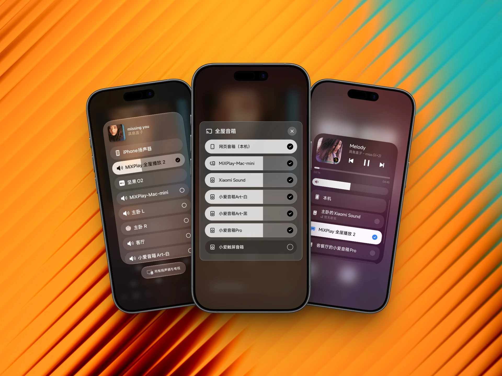

# MiXPlay 

MiXPlay（隔空妙播）是一个面向局域网的`开放式音频中枢`，它融合了 `AirPlay` 隔空播放、`MiPlay`小米妙播、`DLNA`、OwnTone、API 等多种音频协议，搭载独家定制的`全屋播放引擎`，打破生态壁垒：除了**米果互通**，普通安卓与传统音箱也能解锁新玩法！





---

## ✨ 功能特色

- **多协议融合**：AirPlay、MiPlay、DLNA、OwnTone、API等
- **音乐串流**：普通音箱独立推流，全屋音箱同步播放
- **轻装上阵**：Python + Rust 原生桥接，低延迟轻负载
- **操作简单**：网页控制台开箱即用，米家扫码一键登录
- **无损音乐**：最高支持 7.1 声道、192kHz/24bit 音频流
- **多平台通用**：支持 NAS、PC、Mac、Docker 部署服务端

MiXPlay 与苹果、小米公司无关，作为局域网音频中枢必须在 NAS、PC、Mac、Docker 上运行`服务端`，覆盖多种音频协议和音箱设备，可玩性强但不适合所有人。

### 📊 音频方案对比

| 对比维度 | MiXPlay | AirPlay 1| AirPlay 2 | DLNA | 小米妙播 |
| :--- | :--- | :--- | :--- | :--- | :--- |
| **系统级音频投射** | ☑️ 支持 | ✅ 苹果 | ✅ 苹果 | ❌ 部分 App |  ✅ 小米 |
| **多房间同步播放** | ✅ 支持 | ☑️ 仅限 iTunes | ✅ 支持 | ❌ 不支持 | ✅ 支持 |
| **音频通信链路** | ☑️ 同步串流 | ☑️ 同步串流 | ✅ 独立协同 | ☑️ 分离遥控 | ✅ 独立协同 |
| **小爱音箱** | ✅ 全系音箱* | ☑️ Sound 系列  | ☑️ Sound 系列 | ☑️ 部分音箱 | ☑️ 部分音箱 |
| **OwnTone** | ✅ 支持 | ✅ 支持  | ✅ 支持| ✅ 支持 | ❌ 不支持 |
| **通用安卓*** | ✅ 支持 | ❌ 不支持  | ❌ 不支持 | ✅ 支持 | ❌ 不支持  |
| **硬件加密门槛** |  ✅ 无门槛 | ☑️ 苹果授权 | ☑️ 苹果授权 | ✅ 无门槛 | 🔒 小米独占 |

> 🔊 **MiXPlay 支持音箱列表** ➡️ [点我跳转查看](./speaker.md)

### 🤖 手机平板特殊玩法
- 接收端，安卓使用[FusionPlay-Android](https://github.com/rosienosiesie/FusionPlay-Android)，支持 AirPlay2、小米妙播、DLNA 接收功能
- 发射端，安卓使用[centuryplay](https://github.com/g8row/centuryplay)，安卓 10+ 支持串流系统音频到 AirPlay 音箱
- 发射端，鸿蒙使用[音桥·阿西西](https://appgallery.huawei.com/app/detail?id=cn.axi.audio)，支持串流系统音频到 AirPlay 音箱


### 🎵 音频格式支持

* **原生直连格式**：`.mp3`、`.m4a`、`.flac`、`.wav`、`.m3u8`
  - 小爱音箱硬件原生解码，音频数据由中枢直接转发，0 额外 CPU 转码开销，无损低延迟。

⚠️ 本项目主要是完善苹果用户的小爱音箱 ✖️ AirPlay 体验，暂不考虑 DLNA 功能。
- DLNA 是一个古早的音频协议，虽然新老设备都能用，但体验不太好、稳定性欠佳
- 小米音箱自带 DLNA 功能不完整，第三方 DLNA 需额外适配，体验依然不完美
- 如果需要第三方 DLNA 功能，推荐使用 MiAir、miair-next 等项目

---
## ❤️ 支持项目

- 打赏鼓励：支持我开发更多有趣应用
- 互动群聊：加入 💬 [QQ 群](https://qm.qq.com/q/ZzOD5Qbhce) 可在线催更
- 更多内容：访问 ➡️ [谢週五の藏经阁](https://5nav.eu.org)

<div align="center">
  <table>
    <tr>
      <td align="center">
        <br/>
        <sub>微信</sub>
      </td>
      <td align="center">
        <br/>
        <sub>支付宝</sub>
      </td>
    </tr>
  </table>
</div>

---
## 🚀 安装方式

MiXPlay 目前支持以下主流平台和架构：
| 平台/架构 |  x86_64 | arm64 |
| :---: | :---: | :---: |
| Linux/NAS | ✅ | ✅ |
| macOS | ❌ | ✅ |
| Windows | ✅ | ❌ |

### 1、NAS（飞牛 & Docker）
飞牛商店【🔍MiXPlay - 隔空妙播】，其他 NAS 可使用 Docker 版
> 2026.10.8 飞牛商店审核中暂未上架，可加群获取内测版 fpk 文件手动安装

```bash
services:
  mixplay:
    image: ghcr.io/juneix/mixplay
    # image: docker.1ms.run/juneix/mixplay  # 毫秒镜像加速
    container_name: mixplay
    network_mode: host
    restart: unless-stopped
    environment:
      WEB_PORT: 8820 #访问端口
    devices:
      - /dev/snd:/dev/snd #设备声卡
    volumes:
      - ./conf:/app/conf #配置文件
      - /sys/class/dmi/id:/host/sys/class/dmi/id:ro #硬件机器码
```


### 2、桌面端

a. 安装 uv 环境   
🍎 macOS / 🐧 Linux
```bash
curl -LsSf https://astral.sh/uv/install.sh | sh
```
🪟 Windows
```bash
powershell -ExecutionPolicy ByPass -c "irm https://astral.sh/uv/install.ps1 | iex"
```
b. 安装 mixplay
```bash
uv tool install --python 3.12 mixplay-hub
```

打开终端输入 `mixplay-desktop`，自动后台运行，系统托盘可快速打开控制台、查看日志或退出。


## 🎈 版本区别

飞牛 fpk 和桌面端 uv 版本，正常重装系统，唯一机器码不变 (虚拟机、更换主板等除外)，Docker 版本请正确挂载 `/sys/class/dmi/id`。


| 功能 | 普通用户 | 头号玩家 |
| :---: | :---: | :---: |
| Audio Hub 音频中枢 | ☑️ | ✅ |
| 小米音箱➡️AirPlay1 | ☑️ | ✅ |
| 服务端音箱➡️AirPlay1、妙播、DLNA | ☑️ | ✅ |
| AirPlay2 | ❌ | ✅ |
| 全屋播放、串流节点 | ❌  | ✅ |

### 📢 上游鸣谢与合规说明

本项目的基础协议、桥接能力整合了以下优秀的开源组件：
- **小米云服务**：[miservice](https://pypi.org/project/miservice/) (MIT)
- **小米妙播（MiPlay）**：[FusionPlay-Android](https://github.com/rosienosiesie/FusionPlay-Android) (AGPL-3.0)
- **隔空播放（AirPlay 1/2）**：[shairplay-rust](https://github.com/metaneutrons/shairplay-rust) (LGPL-3.0)

> **💡 灵感与思路参考**：
> 本项目在开发与设计过程中，还参考了以下社区项目的思路并进行了重构与自用优化，在此特别致谢：
> - [MiAir](https://github.com/KiriChen-Wind/MiAir) / [miair-next](https://github.com/deerwan/miair-next) / [XiaoMusic](https://github.com/hanxi/xiaomusic)

**📌 功能边界与授权说明**：
- **基础免费能力**：基于上述上游组件实现的基础功能**免费开放使用**。
- **自研定制模块**：本项目自研的 `Audio Hub 音频中枢`、`MiXPlay 全屋播放`、`串流节点延迟对齐` 等组合玩法属于定制扩展包，仅供**头号玩家预览体验**。
- **第三方开源许可全文**：详见项目中的 [THIRD-PARTY-NOTICES.md](./THIRD-PARTY-NOTICES.md) 与 [LICENSE](./LICENSE)。